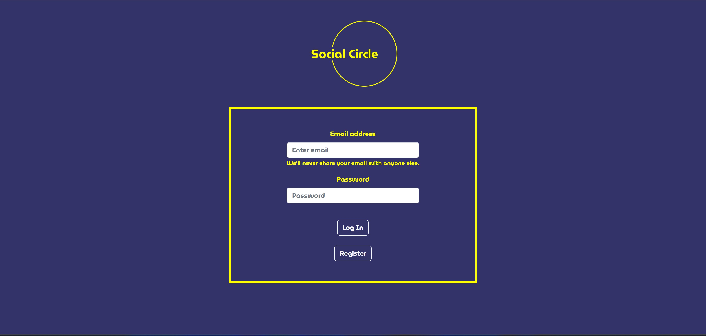
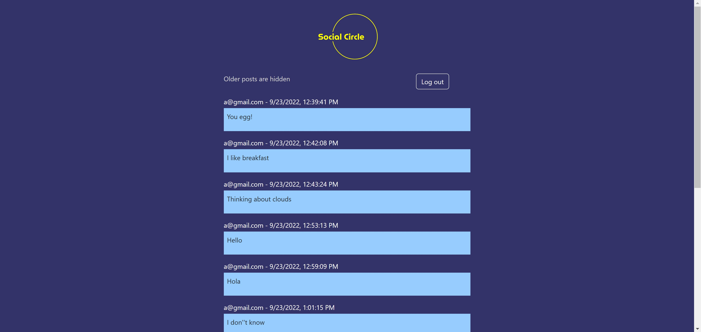
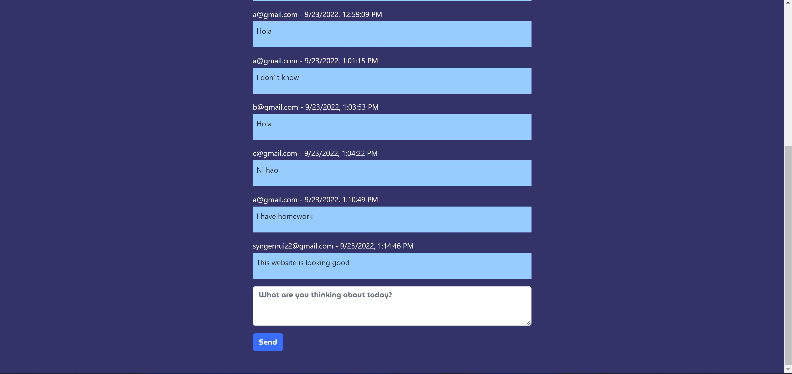

# Social Circle

A simple social media app where users can login and post status texts like Twitter.

> **Authors**: Faris Durrani (@farisdurrani) and Nico Ruiz (@MrSyn88)

Deployed site: https://social-circle.netlify.app

# How to Run

Install NodeJS v16 and NPM v8, and run the following commands:

```
npm install
npm run
```

# Architecture

Frontend - ReactJS </br>
Backend - NodeJS, Firebase Authentication </br>
Database - Firebase NoSQL Firestore Database

# Screenshots

Login page


Social Board page


Social Board page (2)


# License

SocialMediaApp is MIT licensed, as found in the [LICENSE](./LICENSE) file.

SocialMediaApp documentation is Creative Commons licensed, as found in the [LICENSE-docs](./.github/LICENSE-docs) file.
